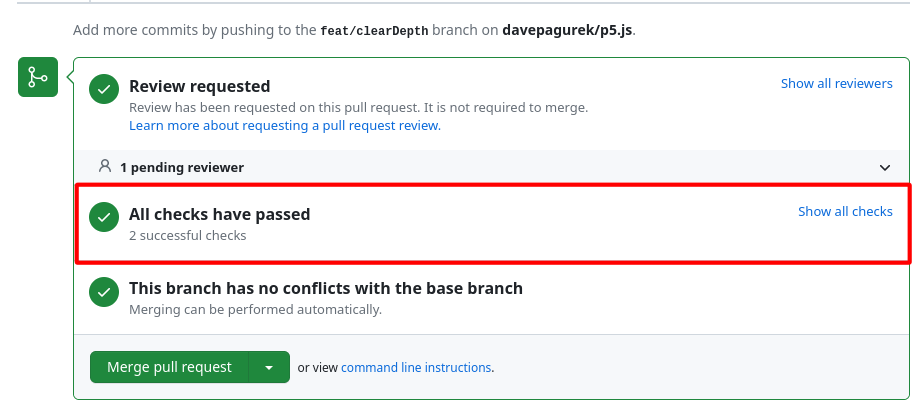

<!-- p5.js への投稿を管理およびレビューする方法を学びます。 -->

# 管理者ガイド
あなたが新しい管理者であるか、p5.jsの経験豊富なメンテナーであるか、またはその中間であるかに関わらず、このガイドには多くの情報、ティップス、トリックが含まれており、あなたと他の貢献者がp5.jsに効果的に貢献するのに役立ちます。特に指定がない限り、ここに書かれている内容のほとんどはガイドラインであり、これによってあなたのワークフローに合わせて慣行を適応させることができます。

## 目次
- [Issues](#Issues)
   - [バグ報告](#バグ報告)
   - [機能リクエスト](#機能リクエスト)
   - [機能強化](#機能強化)
  - [議論](#議論)
- [プルリクエスト](#プルリクエスト)
  - [簡単な修正](#簡単な修正)
  - [バグ修正](#バグ修正)
  - [新機能/機能強化](#新機能機能強化)
  - [Dependabot](#dependabot)
- [ビルドプロセス](#ビルドプロセス)
  - [主要なビルドタスク](#主要なビルドタスク)
  - [その他のタスク](#その他のタスク)
- [リリースプロセス](#リリースプロセス)
- [ヒントとテクニック](#ヒントとテクニック)
  - [返信テンプレート](#返信テンプレート)
  - [GitHub CLI](#github-cli)
  - [通知の管理](#通知の管理)

---

## Issues
ソースコードへの貢献において、多くの場合、issueが出発点となります。したがって、issueは議論が行われる場所です。issueをレビューする際のステップは、issueのタイプによって異なります。このリポジトリでは [GitHub issue テンプレート](../.github/ISSUE_TEMPLATE) を使用して、異なるタイプのissueをより良く整理し、issueの作成者に関連情報の提供を促しています。issueをレビューする最初のステップは通常、提供されたテンプレートを確認し、必要に応じて追加情報を要求することです（場合によっては一部のフィールドが未記入であるか、間違ったテンプレートが使用されている可能性があります）。

### バグ報告
バグ報告のissueには、「バグを発見しました」のテンプレートを使用するべきです。通常、バグ報告は以下のプロセスで処理されます：

1. バグを再現する
    - テンプレートの目的は、レビュアーが報告されたバグを再現できる十分な情報を提供することです。
    - 報告されたバグが関連リポジトリ（p5.jsまたはp5.js-website）と関係ない場合：
      - アクセス権がある場合は、issueを関連リポジトリに移動します。
      - そうでない場合は、コメントを残して、バグ報告がどこに提出されるべきかを説明（直接リンクを提供）し、そのissueを閉じます。
    - バグ報告をレビューする最初のステップは、十分な情報が提供され、説明に従ってバグを再現できるかを確認することです。
2. バグが再現できる場合：
    - 時には、特定のバグを修正する最善の方法を決定するための議論が必要です。これは時として簡単で、時には難しいかもしれません。具体的な状況に基づいて決定を下す際には、[p5.js の設計原則](./design_principles.md)を参考にしてください。
    - issueの作者がissue内で修正方法を提供する意向を示している場合：
      - コメントを残し、issueの作者に修正を提供することを承認します。右側の「Assignee」の隣のギアアイコンを使用して、issueをissueの作者に割り当てます。
    - issueの作者が修正を提供する意向がない場合：
      - コメントを残してバグが再現可能であることを確認します。
      - 自分で修正を試みるか、issueに「ヘルプが必要」というラベルを追加して、修正が必要なissueを示します。
3. バグが再現できない場合：
    - 模板中で追加情報（p5.jsのバージョン、ブラウザのバージョン、OSのバージョンなど）がまだ提供されていない場合は、追加情報を要求します。
    - テスト環境がissueで報告されたものと異なる場合（異なるブラウザやOS）：
      - 自分の特定の環境でバグを再現できなかったことを説明するコメントを残します。
      - issueに「ヘルプが必要」というラベルを追加し、issueで指定された設定を持つ他の人にバグの再現を試みてもらいます。
    - 時々、バグはウェブエディターを使用しているときにのみ発生し、ローカルでテストしているときには発生しません。この場合、issueは[ウェブエディターのリポジトリ](https://github.com/processing/p5.js-web-editor)に移動するべきです。
    - 後にバグが再現できるようになった場合は、ステップ2に戻ります。
4. バグがユーザーがバグ報告で提供したコードに由来する場合、p5.jsの動作ではない場合：
    - p5.jsのドキュメントの改善、コード実装の改善、またはフレンドリーなエラーシステムの導入によって、同様のエラーの発生を防ぐことができるかどうかを検討します。
    - p5.jsにさらなる変更がない場合は、任何さらなる問題を[フォーラム](https://discourse.processing.org/)や [Discord](https://discord.com/invite/SHQ8dH25r9)にリダイレクトし、issueを閉じます。

### 機能リクエスト
機能リクエストのissueには、「新機能リクエスト」のissueテンプレートを使用する必要があります。通常、機能リクエストは以下のプロセスで処理されます：

1. p5.jsのアクセシビリティ向上の一環として、すべての機能リクエストは、その機能がどのようにして歴史的に疎外されてきたコミュニティのアクセシビリティを向上させるかを説明する必要があります。詳細については[こちら](./access.md)を参照してください。
   - 「アクセシビリティ向上」のフィールドが十分に記入されていない場合、issueの作成者にその機能がアクセシビリティをどのように向上させるかを説明するよう要求することができます。
   - アクセスの説明はコミュニティの他のメンバー（issueレビュアーを含む）から提供されることもあります。
2. 提案された新機能リクエストが含まれるべきかどうかを以下の基準に基づいて評価します。
   - それはp5.jsのプロジェクトの範囲と[デザイン原則](./design_principles.md)に合致していますか？
     - 例えば、新しい描画プリミティブ形状のリクエストを考慮することができますが、ブラウザベースのIoTプロトコルを採用するリクエストは範囲外かもしれません。
     - 全体として、p5.jsの範囲は比較的狭く保たれるべきです。これは、あまり使用されない機能がコードベースを過剰に膨れ上がらせるのを防ぐためです。
     - ある機能がp5.jsの範囲に合わない場合、それはissueの作者やコミュニティの他のメンバーによってアドオンライブラリとして実装されることができます。
     - 適切かどうかが不明な場合は、コンセプト検証としてアドオンライブラリを作成することを提案するのも良いでしょう。これはユーザーにその機能を使う方法を提供し、その用途と重要性をより具体的に示すものであり、必ずしも完全に統合された完全なソリューションである必要はありません。適切であれば、後にp5.jsのコアに統合することも可能です。
   - それは破壊的変更と見なされる可能性がありますか？
     - それは既存のp5.jsの関数や変数と衝突する可能性がありますか？
     - それはp5.jsで既に書かれている典型的な例と衝突する可能性がありますか？
     - 上記の衝突を引き起こす可能性のある機能は破壊的変更と見なされるべきであり、[メジャーバージョンリリースを行わない限り](https://docs.npmjs.com/about-semantic-versioning)、p5.jsに破壊的変更を加えるべきではありません。
   - 提案された新機能は、

既存のp5.jsの機能、比較的シンプルなネイティブJavaScriptのコード、または既存の使いやすいライブラリを使用して実現できますか？
     - 例えば、`join(["Hello", "world!"])` のような文字列配列を結合するためのp5.js関数を提供する必要はなく、原生JavaScriptの `["Hello", "world!"].join()` を優先するべきです。
3. アクセシビリティ要件と他の考慮事項が満たされた上で、新機能リクエストを承認する前に、少なくとも2人の管理者またはメンテナーの承認が必要です。以下に新機能のPRレビュープロセスについて説明します。

### 機能強化
機能強化のissuesには、「既存の機能強化」のissueテンプレートを使用するべきです。こちらのプロセスは新機能リクエストと非常に似ています。新機能リクエストと機能強化の違いは少し曖昧かもしれませんが、機能強化は主にp5.jsの既存の機能に関連しており、新機能リクエストは完全に新しい機能を追加するリクエストかもしれません。

1. 新機能リクエストと同様に、機能強化はp5.jsのアクセシビリティを向上させる場合にのみ受け入れられるべきです。上記の[パート1](#機能リクエスト)を参照してください。
2. 機能強化の包含基準は上記の機能リクエストと似ていますが、潜在的な破壊的変更に特に注意する必要があります。
   - 既存の機能を変更する場合、すべての以前有効で記録された関数シグネチャは同じ方法で機能する必要があります。
3. PRを開始する前に、少なくとも1人の責任者またはメンテナーの承認が必要です。機能強化のPR審査プロセスは下記で詳しく説明されています。

### 議論
この種のissueにはシンプルなテンプレート（「議論」）があり、より具体的な内容（機能リクエストなど）に主題を統合する前に、その主題に関する一般的なフィードバックを収集するために使用されます。この種のフィードバックが終了し、より具体的な内容が生成された後、この種の議論の問題は閉じることができます：

- 議論の形式でissueが提出されたが、実際にはバグ報告である場合は、適切なタグを使用し、「議論」タグを削除します。同時に、バグ報告に含まれていない他の情報も作者から要求します。
- 議論の形式でissueが開かれたが、ソースコードへの貢献やその他のGitHubリポジトリ/貢献プロセス/貢献コミュニティに関連する問題（例えば、p5.jsのスケッチに最適なプロジェクタータイプについての議論など）ではな

い場合は、それをフォーラムやDiscordにリダイレクトし、issueを閉じます。
- 適用可能な場合、議論のissueに追加のタグを追加して、議論のタイプをさらに特定します。

---

### プルリクエスト
p5.jsリポジトリへのコード貢献は、ほとんどがプルリクエストを通じて行われます。管理者やメンテナーはリポジトリへのプッシュアクセスを持っているかもしれませんが、コードを貢献する際には、彼らも同様にissue > PR > レビュープロセスに従うことが奨励されています。PRをレビューする際に取ることができるいくつかのステップは以下の通りです：

- プルリクエストのテンプレートは[こちら](../.github/PULL_REQUEST_TEMPLATE.md)で見つけることができます。
- ほとんどのプルリクエストには、関連するissueが先に開かれ、議論される必要があります。これは、管理者やメンテナーがPRをレビューする前に、関連する[issueのワークフロー](#issues)に従う必要があることを意味します。
	- このルールの唯一の例外は、非常に小さなスペルミスの修正で、issueを開く必要はなく、マージアクセス権を持つ任意のユーザーが修正をマージできますが、特定の領域の管理者でなくても構いません。
	- この例外は、実際には新しいissueを開くことが通常奨励される状況でのみ適用されます。つまり、この例外が適用されるかどうかに疑問がある場合は、issueを開くだけです。
- プルリクエストが引用したissueを完全に解決しない場合は、元の投稿を編集して「解決 #OOOO」を「対処 #OOOO」と変更することができます。これにより、このPRがマージされたときに元のissueが自動的に閉じられることはありません。

### 簡単な修正
小さなスペルミスの修正などの簡単な修正は、マージアクセス権を持つ任意の人が直接マージすることができます。これには、PRの「変更されたファイル」タブを素早くチェックし、自動化されたCIテストが通過していることを確認する必要があります。

 

 

### バグ修正
1. バグ修正は、関連する領域の管理者によってレビューされるべきで、できればそのissueの修正に同意した同じ人が良いでしょう。
2. PRの「変更されたファイル」タブを使用して、修正がissueの議論で説明された内容と一致するかどうかを初期レビューできます。
3. 必要に応じてローカルでのテストを行うべきです。GitHub CLIはこのプロセスの一部を簡素化するのに役立ちます。（詳細は下記の[Tips & Tricks](#tips-tricks)を参照してください）。
	- 修正は元のissueを十分に解決するべきです。
  - 修正は既存の振る舞いを変更すべきではありません、特に元のissueで合意が形成されている場合を除きます。
	- 修正はp5.jsのパフォーマンスに大きな影響を与えるべきではありません。
	- 修正はp5.jsのアクセシビリティに影響を与えるべきではありません。
	- 修正は現代的なJavaScriptの標準を使用して行われるべきです。
	- 修正はすべての自動テストに合格し、関連する場合は新しいテストを含むべきです。
4. 他の変更が必要な場合は、[ここに記載されている](https://docs.github.com/en/pull-requests/collaborating-with-pull-requests/reviewing-changes-in-pull-requests/commenting-on-a-pull-request#adding-line-comments-to-a-pull-request)通り、関連する行に行レベルのコメントを追加するべきです。
    - 具体的な変更を提案するために、提案モジュールを使用することもできます：\
      \
      \
      
    - 複数の変更が必要な場合は、[ここに記載されている](https://docs.github.com/en/pull-requests/collaborating-with-pull-requests/reviewing-changes-in-pull-requests/reviewing-proposed-changes-in-a-pull-request)通りに複数行コメントを追加し、変更をリクエストすることができます。
    - 行レベルのコメントが単に明確化や議論のために使用される場合は、前のステップで「Comment」と選択し「Request changes」ではなく：\
    
5. PRがレビューされ、他の変更が必要ない場合、担当者はコメントを追加するかどうかにかかわらず、「Approve」オプションを選択して、PRを「Approved」とマークします。次に、必要に応じて別の責任者やメンテナーにさらなるレビューを依頼するか、マージアクセス権を持っていればPRをマージするか、メンテナーが承認されたPRをマージします。
6. @[all-contributors](https://allcontributors.org/docs/en/emoji-key)ボットを呼び出し、新しい貢献者をREADME.mdファイルの貢献者リストに追加する必要があります。各種貢献タイプは下のリンクで見つかる完全なリストから `[contribution type]`で置き換えられます。

 `@all-contributors` `please` `add` `@[GitHub handle]` `for` `[contribution type]`

## 新機能/機能強化
新機能または機能強化のPRのプロセスはバグ修正と似ていますが、一つの顕著な違いがあります。

- 新機能/機能強化のPRは、合併される前に少なくとも2名の管理者またはメンテナーによってレビューおよび承認される必要があります。
  - これは、元の問題を承認した同じ2名の管理者またはメンテナーである場合もあれば、他の人物である場合もあります。

### Dependabot
Dependabot の PR は通常、リポジトリの管理者のみが閲覧可能です。これが関係ない場合は、このセクションをスキップしてください。

- バージョンアップデートが[セマンティックバージョニング](https://semver.org/)のパッチバージョンであり、自動化されたCIテストが通過した場合、DependabotのPRは直接マージすることができます。
- DependabotのPRがセマンティックバージョニングのマイナーバージョン変更を伴い、自動化されたCIテストが通過した場合、通常は直接マージできますが、アップデートされた依存関係の変更ログを素早くチェックすることをお勧めします。
- DependabotのPRがセマンティックバージョニングのメジャーバージョン変更を伴う場合、ビルドプロセスやp5.jsの機能に影響を与える可能性があります。この場合、レビュアーはできるだけ現在のバージョンからターゲットバージョンまでの変更ログをチェックし、ローカルでPRをテストして、すべてのプロセスが正常に機能していることを確認し、依存関係の潜在的な重大変更に対して必要な変更を行うことが奨励されます。
  - 多くの依存関係がメジャーバージョンを上げる理由は、非常に古いNode.jsバージョンの公式サポートが終了したためであり、これは多くの場合、依存関係APIの変更による破壊的変化を必ずしも意味しないことを意味します。

---

# ビルドプロセス
このセクションでは、一般的なビルドの設定やコマンドについては扱わず、背後で起こっている詳細に焦点を当てます。上記の内容については、[貢献者ガイド](./contributor_guidelines.md#working-on-p5js-codebase)を参照してください。

Gruntfile.jsファイルには、p5.jsおよびその他のコンテンツの主要なビルド定義が含まれています。ビルドライブラリやドキュメントで使用されるさまざまなツールには、Grunt、Browserify、YUIDoc、ESLint、Babel、Uglify、Mochaなどがあります。`default`タスクから始めて、逆方向で分析すると役立つかもしれません。

## 主要なビルドタスク

```js
grunt.registerTask('default', ['lint', 'test']);
```
`grunt`やnpmスクリプトの`npm test`を実行すると、`lint`と`test`を含むデフォルトタスクが実行されます。

#### `lint` タスク

```js
grunt.registerTask('lint', ['lint:source', 'lint:samples']);
```
`lint`タスクには`lint:source`と`lint:samples`の二つのサブタスクが含まれています。`lint:source`はさらに三つのサブタスクに分けられています：`eslint:build`、`eslint:source`、そして`eslint:test`。これらは ESLint を使用してビルドスクリプト、ソースコード、テストスクリプトをチェックします。

`lint:samples`タスクはまず`yui`タスクを実行します。このタスクには`yuidoc:prod`、`clean:reference`、そして`minjson`が含まれており、これらはソースコードからドキュメントをJSONファイルに抽出し、前のステップで使用されなかったファイルを削除し、生成されたJSONファイルを`data.min.json`に圧縮します。

次に、`lint:samples`では`eslint-samples:source`というカスタムタスクがあり、その定義は[./tasks/build/eslint-samples.js](./tasks/build/eslint-samples.js)にあります。このタスクはESLintを使用してドキュメントのサンプルコードをチェックし、それがp5.jsの残りの部分と同じコーディング標準に従っていることを確認します（ここで最初に`yui`を実行するのは、サンプルをチェックする前にJSONファイルを構築する必要があるためです）。

#### `test` タスク

```js
grunt.registerTask('test', [
  'build',
  'connect:server',
  'mochaChrome',
  'mochaTest',
  'nyc:report'
]);
```
まず、`test`内の`build`タスクを見てみましょう。
```js
grunt.registerTask('build', [
  'browserify',
  'browserify:min',
  'uglify',
  'browserify:test'
]);
```

`browserify` で始まるタスクは [./tasks/build/browserify.js](./tasks/build/browserify.js) で定義されており、似たようなステップを実行しますが、いくつかの微妙な違いがあります。以下は、多数の p5.js ソースファイルを1つの完全なライブラリに統合する主要なステップです：

- `browserify` は p5.js を構築する責任があり、`browserify:min` は次の圧縮ステップのための中間ファイルを構築します。`browserify` と `browserify:min` の違いは、`browserify:min` が FES 実行に必要なデータを含まないことです。
- `uglify` は `browserify:min` の出力ファイルを圧縮し、最終的な p5.min.js ファイルを生成します（このステップの設定はメインの Gruntfile.js にあります）。
- `browserify:test` は完全な p5.js バージョンと同じものを構築しますが、テストのコードカバレッジレポートのために追加のコード（[Istanbul](https://istanbul.js.org/) を使用）が加えられています。

browserify ステップの中で、ファイルを単一のファイルにマージする以外にもいくつかのステップが実行されます。最初に、`brfs-babel` を使用して `fs.readFileSync()`（Node.js 固有のコード）の使用をファイルの実際の内容に置き換えます。これは主に WebGL コードで使用され、シェーダーコードが独立したファイルとして記述されている場合に、そのコードをソースコードにインラインで含めるためです。

次に、Babel を使用して node_modules のすべての依存関係のソースコードをトランスパイルし、[Browserslist](https://browsersl.ist/) の要求に従って package.json で定義されている要件に一致させ、ES6 のインポートステートメントを browserify が理解できる CommonJS の `require()` に変換します。これにより、ES6 やそれ以上の新しい構文を使用でき、ブラウザの互換性の問題を心配することなく進めることができます。

バンドル後でもファイルに書き込む前に、コードは `pretty-fast` で実行されます。コードが縮小されるべきでない場合は、最終的なフォーマットをより一貫性のあるものにするために、コードをクリーンアップする必要があります（必要に応じて、p5.js のソースコードは読みやすく、参照可能であるべきです）。

ここにはいくつかの小さな詳細なステップが省略されています。上記リンクの browserify ビルド定義ファイルを参照すると、すべての内容についてより詳細に理解することができます。

```
connect:server
```
このステップは、テストファイルとビルドされたソースコードファイルをホストするローカルサーバーを起動し、Chromeで自動テストを実行できるようにします。

```
mochaChrome
```
このステップは[./tasks/test/mocha-chrome.js](./tasks/test/mocha-chrome.js)で定義されています。Puppeteerを使用してヘッドレス版のChromeを起動し、リモートコントロールを可能にし、`./test`フォルダ内のHTMLファイルに関連付けられたテストを実行します。これには、ライブラリの未圧縮バージョンと圧縮バージョンの両方に対するユニットテストと、すべての参照例のテストが含まれます。


```
mochaTest
```
`mochaChrome`とは異なり、このステップはnode.js上で実行され、Chromeでは実行されません。そして、ライブラリのごく一部の機能のみをテストします。p5.jsのほとんどの機能はブラウザ環境を必要とするため、新しいテストが実際にブラウザ環境を必要としない場合にのみ、このテストコレクションを拡張すべきです。


```
nyc:report
```
最後に、すべてのビルドとテストが完了した後、このステップでは`mochaChrome`がライブラリの完全バージョンに対して行ったテストカバレッジレポートを収集し、テストカバレッジデータをコンソールに出力します。p5.jsのテストカバレッジは、主に監視といくつかの追加データポイントを提供するために使用されます。私たちの目標は、100%のテストカバレッジを達成することではありません。

これで、Gruntfile.jsの設定でのデフォルトタスクについての説明をカバーしました！


## 雑務タスク
必要に応じて、`npx grunt [step]`を使用して、すべてのステップ、サブステップ、サブサブステップを直接実行することができますが、特定のステップがこの連鎖の以前のステップに依存している場合、操作してもあまり意味がない場合があります。また、上記で触れられていないが、特定の状況で役立つ可能性のあるタスクもいくつかあります。


```
grunt yui:dev
```
このタスクは、上述の文書とライブラリのビルドを実行し、その後、Webサーバーを起動して、[http://localhost:9001/docs/reference/](http://localhost:9001/docs/reference/)の参照ページの機能に似たバージョンを提供します。その後、ソースコードの変更を監視し、文書とライブラリを再構築します。

インラインドキュメントで作業している場合、これは便利です。なぜなら、ビルドされたファイルをp5.jsリポジトリからローカルのp5.js-websiteリポジトリに移動してサイトを再構築する必要がなく、ブラウザで変更をプレビューできるからです。この方法で、変更がサイト上で正しく表示される可能性が高くなります。ただし、この使用はインラインドキュメントの変更に限られ、参照ページ自体の変更（スタイルやレイアウトを含む）はウェブサイトリポジトリで行い、テストする必要があります。


```
grunt watch
grunt watch:main
grunt watch:quick
```
watchタスクは、一連のファイルの変更を監視し、変更されたファイルに基づいて関連タスクを実行して、参照文書やライブラリを構築します。これらのタスクの機能は同じで、唯一の違いはスコープです。

`watch`タスクは、ソースコードの変更が検出された場合、すべてのビルドとテストを実行します。これは、ソースコードで完全なデフォルトタスクを実行するのと同様です。

`watch:main`タスクは、ソースコードの変更が検出された場合、ライブラリのビルドとテストを実行しますが、参照文書は再構築しません。

`watch:quick`タスクは、ソースコードの変更が検出された場合、ライブラリのビルドのみを実行します。

作業内容に応じて、最も簡略化されたwatchタスクを選択することで、手動で再ビルドする時間を節約できます。

---

# リリースプロセス
[release_process.md](./release_process.md)を参照してください。

---

# ヒントとテクニック
時には、レビューする問題やPRの数が圧倒的になることがあります。私たちはプロセスを簡素化するために努力していますが、問題やPRをレビューするのに役立ついくつかのヒントとテクニックを利用することができます。

## 返信テンプレート
GitHubの[Saved Replies](https://docs.github.com/en/get-started/writing-on-github/working-with-saved-replies/about-saved-replies)機能を使用することができます。これは、問題やPRに返信する際に便利な機能で、作業フローで説明されているいくつかのステップ（問題をフォーラムにリダイレクトする、修正のために問題を受け入れるなど）に同じ、または非常に似た返信を使用する必要がある場合、Saved Repliesを使用すると効率が向上します。

以下は、p5.jsのメンテナーが使用しているいくつかのSaved Repliesです。これらを使用することも、自分自身のSaved Repliesを作成することもできます！

#### 閉じる：再現不可
> この問題を再現することができませんでしたが、問題のコード例を提供できる場合は、いつでも再開してください。ありがとうございます！

#### 閉じる：コードスニペットが必要
> 組織の目的のために、この問題を閉じます。問題を示すコードスニペットを提供できる場合は、再開してください。ありがとうございます！

#### 閉じる：フォーラムを使用してください！
> ここでのGitHubの問題は、p5.jsライブラリ自体のバグや問題を報告するのに適しています。自分のコードの作成、テスト、チュートリアルのフォローに関する質問がある場合は、[フォーラム](https://discourse.processing.org/)で投稿してください。ありがとうございます！

#### 閉じる：GSOC
> ありがとうございます！GSOC提案について話し合う最適な場所は、私たちの[フォーラム](https://discourse.processing.org/c/summer-of-code)です。

#### 閉じる：アクセス権
> この問題を一時的に閉じます。なぜなら、[アクセス権を広げる](https://github.com/processing/p5.js/blob/main/contributor_docs/access.md)に関するより詳細な説明が見られなかったからです。問題リクエストにアクセス権に関するより詳細な説明を追加できる場合は、いつでも再開してください。

> この問題を一時的に閉じます。なぜなら、[アクセス権を広げる](https://github.com/processing/p5.js/blob/main/contributor_docs/access.md)に関するより詳細な説明が見られなかったからです。機能リクエストにアクセス権に関するより詳細な説明を追加できる場合は、いつでも再開してください。ありがとうございます！

#### 閉じる：プラグイン
> この機能はp5.js APIの範囲を超えていると思われます（私たちはできるだけシンプルに保つようにしていますが）、しかし、これは良いプラグインライブラリの出発点になる可能性があります。プラグインを作成する方法については、こちらのドキュメントをご覧ください：https://github.com/processing/p5.js/blob/main/contributor_docs/creating_libraries.md

#### PRを閉じる：問題を先に提出してください
> ありがとうございます。リマインダーとして、プルリクエストを開く前に問題を開き、プルリクエストに問題タグを使用する必要があります。これは、開発を追跡し、議論を明確に保つために必要です。ありがとうございます！

#### 問題修正の承認
修正を進めることができます。ありがとうございます。

#### PRをマージ
良さそうです。ありがとうございます！

## GitHub CLI
複雑なPRのレビューを行う際に、複雑なgitコマンドを使用してPRのコードを取得し、ローカルでテストを行うことは困難になる可能性があります。幸いなことに、[GitHub CLI](https://cli.github.com/) ツールは、このプロセスやその他の操作を大幅に簡素化するのに大いに役立ちます。

CLIをインストールしてログインした後、`gh pr checkout [pull_request_id]` コマンドを実行するだけで、PRをローカルでレビューできます。このコマンドは、リモートフォークを自動的に取得し、ブランチを作成してそのブランチに切り替えます。メインブランチに戻るには、ブランチを切り替えるように `git checkout main` を実行するだけです。CLIから直接PRにコメントを残すこともできますので、ウェブページを訪れる必要はありません！

GitHub CLIは、他にも多くのコマンドを提供しており、それらが役立つことがあるでしょう。とにかく、これは素晴らしいツールです。

### 管理通知

もはや手動でリポジトリの"Issues"や"Pull Requests"タブを監視して、新しいissuesやPRをチェックする必要はありません。リポジトリページの上部にある、リポジトリ名の反対側に位置する目のアイコンがついた"Watch"ボタンをクリックして、そのリポジトリを「ウォッチ」することができます。


リポジトリをウォッチすることで、新しいissues、新しいPRs、あなたのユーザー名の提及、その他リポジトリで購読した活動などが[通知ページ](https://github.com/notifications)に通知として送られ、電子メールの受信箱を処理するように、それらを既読にしたり無視したりすることができます。

場合によっては、フォローしているリポジトリの活動に関連するGitHubからの電子メールが送信されることがあり、[通知設定ページ](https://github.com/settings/notifications)でカスタマイズすることができます。完全に購読を解除することも含まれます。

これらの通知をあなたの作業スタイルに合わせて設定することで、関連するissues/PRを手動で検索することなく、またGitHubの絶え間ない通知に圧倒されることなく、良いバランスを保つことができます。初期設定としては、リポジトリの"Issues"と"Pull Requests"をウォッチし、「参加、提及、カスタム」時のみ電子メール通知を受け取るように設定することをお勧めします。

